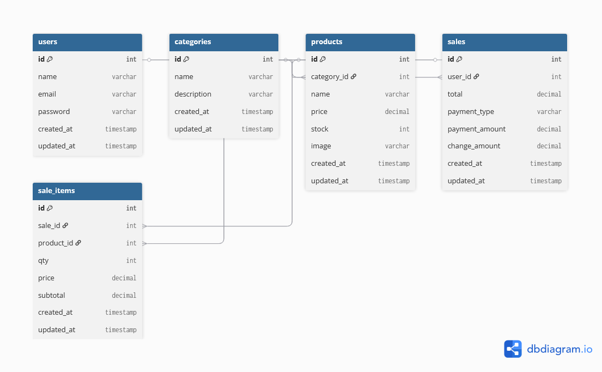
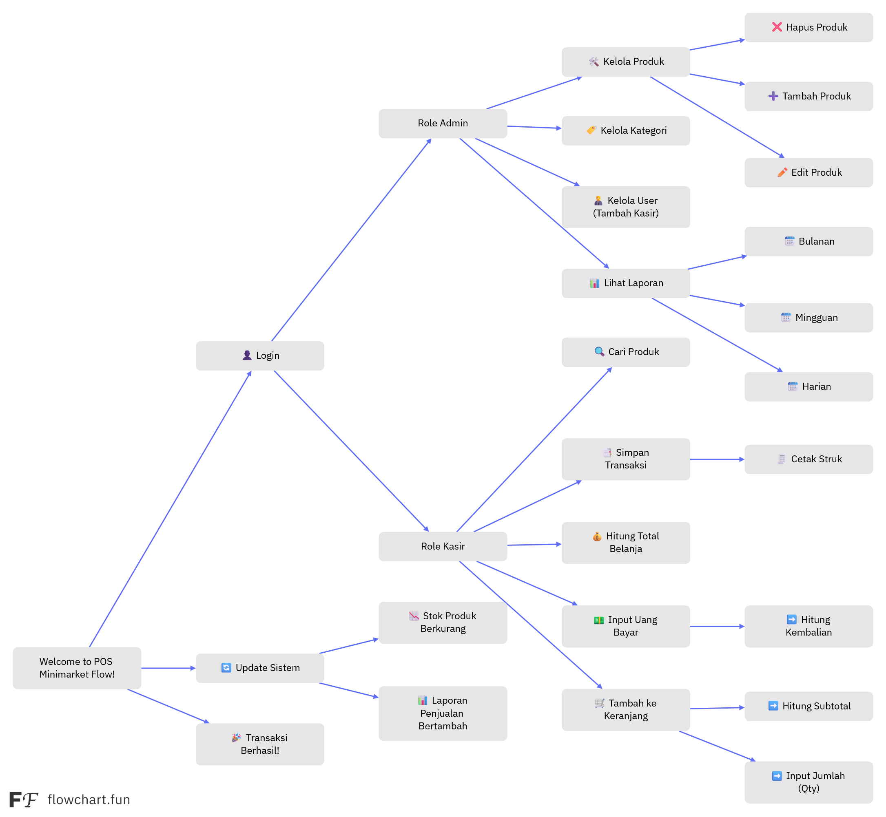

# 🛒 POS-Kasir - Point of Sale System

<p align="center">
  
  
  
  
  
  
  
  
  
</p>

<p align="center">
  <strong>🚀 Sistem Point of Sale (POS) Modern dengan Tall Stack Laravel 12</strong>
</p>

## 📋 Tentang POS-Kasir

POS-Kasir adalah sistem Point of Sale yang dibangun dengan **Tall Stack Laravel 12** (Tailwind CSS, Alpine.js, Livewire) yang menyediakan solusi lengkap untuk mengelola penjualan ritel. Sistem ini dirancang untuk kemudahan penggunaan dengan interface yang modern, responsif, dan fitur-fitur canggih untuk operasional bisnis ritel sehari-hari.

### 🎉 **Latest Updates (v1.1.0)**

-   ✨ **Enhanced Table System** - Semua tabel dashboard sekarang menggunakan komponen reusable dengan sorting terintegrasi
-   📱 **Responsive Filter Layouts** - Layout filter yang dioptimalkan untuk semua ukuran layar
-   🔄 **Real-time Sorting** - Sorting functionality pada semua kolom tabel (Name, Price, Stock, Date)
-   🎨 **UI/UX Improvements** - Interface yang lebih konsisten dan user-friendly
-   📊 **Advanced Analytics** - Dashboard dengan statistik real-time dan chart interaktif

### 🚀 **Coming Soon: Auto Product Scan**

Kami sedang mengembangkan fitur scan produk otomatis yang akan memungkinkan:

-   📱 Scan barcode/QR code menggunakan kamera device
-   🖥️ Support webcam untuk desktop
-   ⚡ Instant product lookup dan cart addition
-   📊 Scan analytics dan history tracking

### ✨ Fitur Utama

-   🛒 **POS Transaction** - Interface transaksi penjualan real-time dengan cart management
-   📊 **Dashboard Analytics** - Dashboard dengan chart interaktif dan statistik penjualan real-time
-   📋 **Transaction Management** - Manajemen transaksi dengan fitur pencarian, filter, dan sorting advanced
-   👥 **Role & Permission System** - Kontrol akses berbasis role menggunakan Spatie Laravel Permission
-   📱 **Responsive Design** - UI modern dan responsif untuk semua perangkat dengan grid layout adaptive
-   🔔 **Sweet Alert Notifications** - Notifikasi cantik dan interaktif untuk feedback user
-   📄 **PDF Receipt Generation** - Generate struk penjualan dalam format PDF dengan DomPDF
-   🎨 **Modern UI/UX** - Desain interface yang intuitif dengan komponen reusable dan konsisten
-   🔄 **Real-time Updates** - Update data real-time menggunakan Livewire dan Alpine.js
-   🛡️ **Secure Authentication** - Sistem autentikasi aman dengan Laravel Breeze
-   📊 **Advanced Table Components** - Tabel reusable dengan sorting, pagination, dan filter terintegrasi
-   🔍 **Smart Search & Filter** - Sistem pencarian dan filter yang powerful dengan debounced input
-   📱 **Mobile-First Layout** - Layout yang dioptimalkan untuk mobile dengan progressive enhancement
-   🚀 **Performance Optimized** - Lazy loading, caching, dan optimisasi query untuk performa maksimal
-   📷 **Product Image Management** - Upload dan manajemen gambar produk dengan storage link
-   🏷️ **Category Management** - Sistem kategori produk dengan nested structure
-   💰 **Payment Processing** - Multiple payment methods (Cash, Card, Transfer) dengan kalkulasi otomatis
-   📈 **Sales Analytics** - Analitik penjualan dengan chart interaktif menggunakan Chart.js
-   🔄 **Inventory Tracking** - Tracking stok produk real-time dengan alert low stock
-   📊 **Export & Reporting** - Export data ke berbagai format untuk reporting
-   🎯 **User Experience Focus** - UX yang smooth dengan loading states dan error handling
-   🔧 **Modular Architecture** - Kode yang maintainable dengan service layer dan repository pattern
-   🧪 **Comprehensive Testing** - Test coverage dengan Pest PHP untuk reliability
-   🚀 **Production Ready** - Optimized untuk deployment dengan caching dan asset bundling

### 🚀 **Upcoming Features**

-   📱 **Auto Product Scan** - Scan produk otomatis menggunakan barcode/QR code scanner
-   🔔 **Push Notifications** - Notifikasi real-time untuk low stock alerts dan sales updates
-   📊 **Advanced Analytics** - Business intelligence dengan predictive analytics
-   🔗 **API Integration** - RESTful API untuk integrasi dengan sistem eksternal
-   📱 **Mobile App** - Aplikasi mobile companion untuk iOS dan Android
-   🤖 **AI-Powered Insights** - Rekomendasi produk dan analisis tren menggunakan AI
-   💳 **Payment Gateway Integration** - Integrasi dengan payment gateway populer
-   📦 **Multi-Store Support** - Manajemen multiple store locations
-   🌐 **Multi-Language Support** - Dukungan bahasa Indonesia dan English
-   ☁️ **Cloud Backup** - Automatic backup ke cloud storage
-   📊 **Custom Reports** - Report builder untuk laporan custom
-   🔄 **Offline Mode** - Mode offline untuk operasi tanpa koneksi internet

## �️ **Development Roadmap**

### Phase 1: Core Enhancement (Current - v1.1.0) ✅

-   [x] Advanced table components with sorting
-   [x] Responsive filter layouts
-   [x] Mobile-first design optimization
-   [x] Real-time dashboard analytics
-   [x] Enhanced POS transaction system

### Phase 2: Automation & AI (Next - v1.2.0) 🔄

-   [ ] **Auto Product Scan** - Barcode/QR code scanner integration
    -   📱 Camera-based scanning untuk mobile devices
    -   🖥️ Webcam support untuk desktop
    -   🔄 Real-time product lookup dan cart addition
    -   📊 Scan history dan analytics
    -   🎯 Multiple barcode format support (EAN-13, QR Code, Code 128)
    -   **Tech Stack**: QuaggaJS + Instascan + WebRTC API
    -   **Implementation**: Livewire component dengan Alpine.js integration
    -   **Database**: Scan history table untuk tracking dan analytics
-   [ ] **AI-Powered Insights** - Product recommendations and trend analysis
-   [ ] **Smart Inventory Alerts** - Automated low stock notifications
-   [ ] **Predictive Analytics** - Sales forecasting and demand prediction

### Phase 3: Connectivity & Integration (v1.3.0) 📅

-   [ ] **API Integration** - RESTful API for external system integration
-   [ ] **Payment Gateway** - Integration with popular payment providers
-   [ ] **Multi-Store Support** - Management of multiple store locations
-   [ ] **Cloud Backup** - Automated cloud storage backup

### Phase 4: Advanced Features (v2.0.0) 🚀

-   [ ] **Mobile App** - Native iOS and Android companion apps
-   [ ] **Offline Mode** - Full offline operation capability
-   [ ] **Custom Reports** - Advanced report builder with drag-and-drop
-   [ ] **Multi-Language Support** - Indonesian and English localization

### Phase 5: Enterprise Features (v2.1.0) 🏢

-   [ ] **Advanced User Management** - Team collaboration and role delegation
-   [ ] **Business Intelligence** - Advanced analytics and KPI dashboards
-   [ ] **Integration Marketplace** - Third-party app integrations
-   [ ] **Enterprise Security** - Enhanced security and compliance features

## �🛠️ Tech Stack (Tall Stack Laravel 12)

### Backend

-   **Laravel Framework**: `^12.0` - Framework PHP terdepan untuk web development
-   **Livewire**: `^3.6` - Framework full-stack untuk Laravel dengan komponen reaktif
-   **PHP**: `^8.2` - Bahasa pemrograman server-side

### Frontend

-   **Alpine.js**: `^3.x` - Framework JavaScript minimalis untuk interaktivitas
-   **Tailwind CSS**: `^3.1.0` - Utility-first CSS framework
-   **Chart.js**: `^4.5.0` - Library charting untuk visualisasi data

### Database & Storage

-   **MySQL**: `^8.0+` - Database relasional untuk penyimpanan data
-   **Laravel Eloquent ORM** - ORM yang powerful dan elegan

### Security & Permissions

-   **Laravel Breeze**: `^2.3` - Sistem autentikasi sederhana dan aman
-   **Spatie Laravel Permission**: `^6.21` - Manajemen role dan permission yang fleksibel

### Tools & Utilities

-   **DomPDF**: `^3.1` - Library untuk generate PDF dari HTML
-   **SweetAlert2**: `^11.23.0` - Library alert dan modal yang cantik
-   **Vite**: `^7.0.4` - Build tool modern untuk asset bundling
-   **Pest**: `^4.0` - Framework testing yang elegan
-   **QuaggaJS**: `^0.12.1` - Library barcode scanning (upcoming feature)
-   **Instascan**: `^1.0.0` - QR code scanner library (upcoming feature)

## 📦 Dependencies Lengkap

### Composer Dependencies (PHP)

```json
{
    "php": "^8.2",
    "laravel/framework": "^12.0",
    "livewire/livewire": "^3.6",
    "laravel/breeze": "^2.3",
    "spatie/laravel-permission": "^6.21",
    "barryvdh/laravel-dompdf": "^3.1",
    "laravel/tinker": "^2.10.1"
}
```

### NPM Dependencies (JavaScript/CSS)

```json
{
    "chart.js": "^4.5.0",
    "sweetalert2": "^11.23.0",
    "@tailwindcss/forms": "^0.5.2",
    "tailwindcss": "^3.1.0",
    "vite": "^7.0.4",
    "axios": "^1.11.0",
    "quagga2": "^0.0.18",
    "instascan": "^1.0.0"
}
```

## 🚀 Panduan Instalasi Lengkap

### 📋 Prasyarat Sistem

Sebelum memulai instalasi, pastikan sistem Anda memenuhi persyaratan berikut:

-   **PHP**: `8.2` atau lebih tinggi
-   **Composer**: `2.x` (PHP dependency manager)
-   **Node.js**: `18.x` atau lebih tinggi
-   **NPM**: `9.x` atau lebih tinggi (biasanya sudah terinstall dengan Node.js)
-   **MySQL**: `8.0+` atau MariaDB `10.3+`
-   **Git**: Untuk cloning repository

### 🔧 Langkah Instalasi

#### 1. Clone Repository

```bash
# Clone repository dari GitHub
git clone https://github.com/username/pos-kasir.git

# Masuk ke direktori project
cd pos-kasir
```

#### 2. Install PHP Dependencies

```bash
# Install semua dependencies PHP menggunakan Composer
composer install

# Jika menggunakan Laravel Sail (opsional)
# composer require laravel/sail --dev
```

#### 3. Install Node.js Dependencies

```bash
# Install semua dependencies JavaScript dan CSS
npm install
```

#### 4. Konfigurasi Environment

```bash
# Copy file environment example
cp .env.example .env

# Generate application key
php artisan key:generate
```

#### 5. Konfigurasi Database

Edit file `.env` dan sesuaikan konfigurasi database:

```env
# Database Configuration
DB_CONNECTION=mysql
DB_HOST=127.0.0.1
DB_PORT=3306
DB_DATABASE=pos_kasir
DB_USERNAME=your_username
DB_PASSWORD=your_password

# Aplikasi Configuration
APP_NAME="POS-Kasir"
APP_ENV=local
APP_KEY=base64:generated_key_here
APP_DEBUG=true
APP_URL=http://localhost:8000

# Mail Configuration (untuk notifikasi)
MAIL_MAILER=smtp
MAIL_HOST=mailpit
MAIL_PORT=1025
MAIL_USERNAME=null
MAIL_PASSWORD=null
MAIL_ENCRYPTION=null
MAIL_FROM_ADDRESS="hello@example.com"
MAIL_FROM_NAME="${APP_NAME}"
```

#### 6. Buat Database

```sql
-- Buat database baru di MySQL
CREATE DATABASE pos_kasir CHARACTER SET utf8mb4 COLLATE utf8mb4_unicode_ci;
```

#### 7. Jalankan Migrasi dan Seeder

```bash
# Jalankan migrasi database
php artisan migrate

# Jalankan seeder untuk data awal (user admin, roles, dll)
php artisan db:seed
```

#### 8. Build Assets Frontend

```bash
# Build assets untuk production
npm run build

# Atau untuk development dengan hot reload
npm run dev
```

#### 9. Jalankan Aplikasi

```bash
# Jalankan Laravel development server
php artisan serve

# Atau jika menggunakan Laravel Sail
# ./vendor/bin/sail up
```

#### 10. Akses Aplikasi

Buka browser dan kunjungi: `http://localhost:8000`

## 👤 Akun Default

Setelah menjalankan seeder, Anda dapat login dengan akun berikut:

### Admin Account

-   **Email**: `admin@example.com`
-   **Password**: `password`
-   **Role**: Administrator (full access)

### User Account

-   **Email**: `user@example.com`
-   **Password**: `password`
-   **Role**: User (limited access)

## 🎯 Cara Penggunaan

### 🛒 Menggunakan POS System

1. **Login** dengan akun yang tersedia
2. **Akses POS** melalui menu atau langsung ke `/home`
3. **Pilih Produk** dari katalog yang tersedia
4. **Tambah ke Cart** dengan mengklik tombol "Add to Cart"
5. **Atur Quantity** produk di cart
6. **Proses Pembayaran** dengan memasukkan jumlah bayar
7. **Print Receipt** atau simpan transaksi

### 📊 Menggunakan Dashboard

1. **Akses Dashboard** melalui menu utama
2. **Lihat Statistik** penjualan real-time
3. **Monitor Chart** untuk analisis tren penjualan
4. **Kelola Data** produk, kategori, dan transaksi

### 📋 Mengelola Transaksi

1. **Akses Transaction** melalui menu
2. **Cari Transaksi** menggunakan fitur search
3. **Filter berdasarkan Tanggal** menggunakan date picker
4. **Lihat Detail** transaksi dengan expandable rows
5. **Export Data** jika diperlukan

## 📁 Struktur Project

```
pos-kasir/
├── app/
│   ├── Http/
│   │   ├── Controllers/          # Controllers untuk handling request
│   │   └── Livewire/             # Komponen Livewire
│   │       ├── Category/         # Manajemen kategori
│   │       ├── Pos/              # Sistem POS
│   │       │   └── Scanner/      # Komponen scanner (upcoming)
│   │       ├── Product/          # Manajemen produk
│   │       ├── Sale/             # Manajemen penjualan
│   │       └── Transaction/      # Manajemen transaksi
│   ├── Models/                   # Model Eloquent
│   │   ├── Category.php          # Model kategori produk
│   │   ├── Product.php           # Model produk
│   │   ├── Sale.php              # Model penjualan
│   │   └── User.php              # Model user
│   ├── Policies/                 # Authorization policies
│   └── Services/                 # Business logic services
├── database/
│   ├── migrations/               # Database migrations
│   ├── factories/               # Model factories
│   └── seeders/                 # Database seeders
├── public/
│   ├── build/                   # Compiled assets
│   └── storage/                 # Public storage link
├── resources/
│   ├── css/
│   │   └── app.css              # Tailwind CSS styles
│   ├── js/
│   │   ├── app.js               # Alpine.js dan Chart.js setup
│   │   ├── scanner.js           # Barcode/QR scanner setup (upcoming)
│   │   └── utils.js             # Utility functions
│   └── views/
│       ├── components/          # Blade components
│       │   ├── auth/            # Authentication components
│       │   ├── dashboard/       # Dashboard components
│       │   ├── form/            # Form components
│       │   ├── landing/         # Landing page components
│       │   ├── layout/          # Layout components
│       │   └── scanner/         # Scanner components (upcoming)
│       ├── livewire/            # Livewire view components
│       └── auth/                # Authentication views
├── routes/
│   ├── web.php                  # Web routes
│   ├── auth.php                 # Authentication routes
│   └── api.php                  # API routes
├── storage/
│   ├── app/                     # App storage
│   ├── framework/               # Framework cache
│   └── logs/                    # Application logs
├── tests/                       # Test files
├── artisan                      # Laravel CLI
├── composer.json                # PHP dependencies
├── package.json                 # Node dependencies
├── vite.config.js               # Vite configuration
└── tailwind.config.js           # Tailwind configuration
```

## �️ Database Schema

### Tabel Utama

#### 1. Users Table

```sql
- id (Primary Key)
- name (varchar)
- email (varchar, unique)
- email_verified_at (timestamp, nullable)
- password (varchar)
- remember_token (varchar, nullable)
- created_at (timestamp)
- updated_at (timestamp)
```

#### 2. Categories Table

```sql
- id (Primary Key)
- name (varchar)
- description (text, nullable)
- created_at (timestamp)
- updated_at (timestamp)
```

#### 3. Products Table

```sql
- id (Primary Key)
- name (varchar)
- description (text, nullable)
- price (decimal)
- stock_quantity (integer)
- category_id (Foreign Key → categories.id)
- created_at (timestamp)
- updated_at (timestamp)
```

#### 4. Sales Table

```sql
- id (Primary Key)
- user_id (Foreign Key → users.id)
- total_amount (decimal)
- payment_method (enum: cash, card, transfer)
- payment_amount (decimal)
- change_amount (decimal)
- status (enum: completed, pending, cancelled)
- created_at (timestamp)
- updated_at (timestamp)
```

#### 5. Sale Items Table

```sql
- id (Primary Key)
- sale_id (Foreign Key → sales.id)
- product_id (Foreign Key → products.id)
- quantity (integer)
- unit_price (decimal)
- total_price (decimal)
- created_at (timestamp)
- updated_at (timestamp)
```

#### 6. Product Scans Table (Upcoming Feature)

```sql
- id (Primary Key)
- user_id (Foreign Key → users.id)
- product_id (Foreign Key → products.id)
- barcode_data (varchar) - Raw barcode/QR data
- scan_type (enum: barcode, qr_code)
- device_info (json) - Camera/webcam information
- scan_result (enum: success, failed, not_found)
- created_at (timestamp)
- updated_at (timestamp)
```

### Permission Tables (Spatie Laravel Permission)

-   `roles` - Tabel roles
-   `permissions` - Tabel permissions
-   `model_has_permissions` - Pivot table user-permission
-   `model_has_roles` - Pivot table user-role
-   `role_has_permissions` - Pivot table role-permission

## �🔧 Konfigurasi & Kustomisasi

### Environment Variables

File `.env` berisi semua konfigurasi penting:

```env
# Aplikasi
APP_NAME=POS-Kasir
APP_ENV=production
APP_DEBUG=false

# Database
DB_CONNECTION=mysql
DB_HOST=127.0.0.1
DB_DATABASE=pos_kasir

# Mail (untuk notifikasi email)
MAIL_MAILER=smtp
MAIL_HOST=smtp.gmail.com
MAIL_PORT=587

# Storage (untuk upload gambar produk)
FILESYSTEM_DISK=public
```

### Tailwind CSS Customization

Edit `tailwind.config.js` untuk kustomisasi styling:

```javascript
/** @type {import('tailwindcss').Config} */
export default {
    content: [
        "./resources/**/*.blade.php",
        "./resources/**/*.js",
        "./resources/**/*.vue",
    ],
    theme: {
        extend: {
            colors: {
                primary: "#3B82F6",
                secondary: "#10B981",
            },
        },
    },
    plugins: [],
};
```

### Chart.js Configuration

Kustomisasi chart di `resources/js/app.js`:

```javascript
import Chart from "chart.js/auto";

// Chart global configuration
Chart.defaults.responsive = true;
Chart.defaults.maintainAspectRatio = false;
```

## 🧪 Testing

### Menjalankan Tests

```bash
# Jalankan semua tests
php artisan test

# Jalankan dengan coverage
php artisan test --coverage

# Jalankan specific test
php artisan test tests/Feature/PosTest.php
```

### Membuat Test Baru

```bash
# Buat feature test
php artisan make:test PosTransactionTest

# Buat unit test
php artisan make:test ProductModelTest --unit

# Upcoming: Scanner tests
# php artisan make:test ProductScannerTest
# php artisan make:test BarcodeScanTest --unit
```

## 🚀 Deployment

### Production Deployment

1. **Environment Setup**

    ```bash
    # Set environment ke production
    APP_ENV=production
    APP_DEBUG=false
    ```

2. **Optimize Laravel**

    ```bash
    # Cache konfigurasi
    php artisan config:cache
    php artisan route:cache
    php artisan view:cache

    # Optimize autoloader
    composer install --optimize-autoloader --no-dev
    ```

3. **Build Assets**

    ```bash
    npm run build
    ```

4. **Storage Link**
    ```bash
    php artisan storage:link
    ```

### Server Requirements

-   **Web Server**: Apache/Nginx dengan mod_rewrite
-   **PHP Extensions**: BCMath, Ctype, Fileinfo, JSON, Mbstring, OpenSSL, PDO, Tokenizer, XML
-   **SSL Certificate**: Untuk HTTPS (recommended)

## 🔒 Security Features

-   **CSRF Protection** - Laravel built-in CSRF protection
-   **SQL Injection Prevention** - Eloquent ORM protection
-   **XSS Protection** - Blade templating engine
-   **Authentication** - Secure login dengan Laravel Breeze
-   **Authorization** - Role-based access control
-   **Password Hashing** - Bcrypt hashing untuk password
-   **Session Security** - Secure session management

## 📊 ERD (Entity Relationship Diagram)

Berikut adalah diagram relasi entitas dari sistem POS-Kasir:



### Penjelasan ERD:

-   **Users**: Tabel untuk menyimpan data pengguna sistem
-   **Categories**: Tabel kategori produk
-   **Products**: Tabel produk dengan relasi ke categories
-   **Sales**: Tabel header transaksi penjualan
-   **Sale Items**: Tabel detail item dalam satu transaksi penjualan
-   **Product Scans**: Tabel untuk tracking scan history (upcoming feature)
-   **Permissions & Roles**: Tabel untuk sistem role dan permission (Spatie Laravel Permission)

### Relasi Utama:

-   `Users` ↔ `Sales` (One-to-Many): Satu user bisa memiliki banyak transaksi
-   `Categories` ↔ `Products` (One-to-Many): Satu kategori bisa memiliki banyak produk
-   `Products` ↔ `Sale Items` (One-to-Many): Satu produk bisa ada di banyak item penjualan
-   `Sales` ↔ `Sale Items` (One-to-Many): Satu transaksi bisa memiliki banyak item
-   `Users` ↔ `Product Scans` (One-to-Many): Satu user bisa memiliki banyak scan history
-   `Products` ↔ `Product Scans` (One-to-Many): Satu produk bisa memiliki banyak scan history

## 🔄 Flowchart Sistem

Berikut adalah flowchart dari alur kerja sistem POS-Kasir:



### Penjelasan Flowchart:

1. **Login**: User melakukan autentikasi
2. **Dashboard**: Melihat statistik dan navigasi menu
3. **POS Transaction**:
    - Pilih produk → Tambah ke cart → Proses pembayaran → Generate receipt
4. **Transaction Management**:
    - Lihat daftar transaksi → Search/Filter → Lihat detail
5. **Product Management**:
    - Kelola kategori → Kelola produk (CRUD operations)
6. **User Management** (Admin only):
    - Kelola users → Assign roles & permissions

### Alur Utama:

-   **Customer Flow**: Login → POS → Transaction → Receipt
-   **Admin Flow**: Login → Dashboard → Management Modules → CRUD Operations
-   **Cashier Flow**: Login → POS → Process Sales → Print Receipts

## 🐛 Troubleshooting

### Common Issues

1. **Assets not loading**

    ```bash
    npm run build
    php artisan cache:clear
    ```

2. **Database connection error**

    - Periksa konfigurasi `.env`
    - Pastikan MySQL service running
    - Verifikasi database credentials

3. **Permission denied**

    ```bash
    chmod -R 755 storage/
    chmod -R 755 bootstrap/cache/
    ```

4. **Livewire not working**
    ```bash
    php artisan livewire:publish
    npm run build
    ```

## 🤝 Contributing

1. Fork repository
2. Buat feature branch (`git checkout -b feature/AmazingFeature`)
3. Commit changes (`git commit -m 'Add AmazingFeature'`)
4. Push ke branch (`git push origin feature/AmazingFeature`)
5. Buat Pull Request

## 📝 License

Distributed under the MIT License. See `LICENSE` for more information.

## 🙏 Acknowledgments

-   [Laravel](https://laravel.com/) - The PHP Framework for Web Artisans
-   [Livewire](https://laravel-livewire.com/) - A full-stack framework for Laravel
-   [Alpine.js](https://alpinejs.dev/) - A rugged, minimal framework for composing JavaScript behavior
-   [Tailwind CSS](https://tailwindcss.com/) - A utility-first CSS framework
-   [Chart.js](https://www.chartjs.org/) - Simple yet flexible JavaScript charting
-   [Spatie Laravel Permission](https://spatie.be/docs/laravel-permission) - Associate users with roles and permissions

---

<p align="center">
  <strong>Dibuat dengan ❤️ menggunakan Tall Stack Laravel 12</strong>
</p>

<p align="center">
  <a href="#-pos-kasir---point-of-sale-system">Kembali ke atas</a>
</p>

## 📋 Tentang BreezeShield

BreezeShield adalah aplikasi Laravel yang telah dikonfigurasi sebelumnya dan menyediakan fondasi yang solid untuk membangun aplikasi web modern. Dilengkapi dengan semua yang Anda butuhkan untuk mulai mengembangkan aplikasi dengan cepat - autentikasi, kontrol akses berbasis role, komponen UI yang indah, dan lainnya.

### ✨ Fitur Utama

-   🔐 **Sistem Autentikasi Lengkap** - Menggunakan Laravel Breeze
-   👥 **Manajemen Role & Permission** - Menggunakan Spatie Laravel Permission
-   📊 **Chart Interaktif** - Menggunakan Chart.js untuk visualisasi data
-   🎨 **UI Dashboard yang Indah** - Desain modern dan responsif
-   🔔 **Integrasi Sweet Alert** - Alert dan notifikasi yang cantik
-   📱 **Responsif Mobile** - Bekerja sempurna di semua perangkat
-   🎯 **Siap untuk Operasi CRUD** - Tinggal tambahkan logika bisnis Anda
-   🛡️ **Aman Secara Default** - Mengikuti praktik terbaik Laravel

## 🛠️ Stack Teknologi

-   **Backend**: Laravel 11.x
-   **Frontend**: Blade Templates + Tailwind CSS + Alpine.js
-   **Charts**: Chart.js 4.x
-   **Autentikasi**: Laravel Breeze
-   **Manajemen Role**: Spatie Laravel Permission
-   **Alert**: SweetAlert2
-   **Database**: MySQL/PostgreSQL/SQLite
-   **Build Tool**: Vite
-   **Styling**: Tailwind CSS + Komponen Custom

## 📦 Yang Sudah Disediakan

### 🔐 Sistem Autentikasi

-   Registrasi dan login pengguna
-   Fungsi reset password
-   Verifikasi email
-   Fungsi remember me
-   Manajemen profil

### 👥 Sistem Role & Permission

-   Role yang sudah dikonfigurasi (Admin, User)
-   Kontrol akses berbasis permission
-   Interface assignment role
-   Proteksi middleware

### 🎨 Komponen UI

-   **Layout Components** (`resources/views/components/layout/`)
    -   Layout dashboard modern
    -   Navigation responsif
    -   Sidebar dan header
-   **Auth Components** (`resources/views/components/auth/`)
    -   Form login dan register
    -   Komponen verifikasi email
-   **Form Components** (`resources/views/components/form/`)
    -   Input fields yang konsisten
    -   Button styles
    -   Form validation display
-   **UI Components** (`resources/views/components/ui/`)
    -   Cards dan panels
    -   Tables siap pakai
    -   Modals dan dialogs
-   **Home Components** (`resources/views/components/home/`)
    -   Hero section
    -   Feature highlights
    -   Call-to-action buttons

### 🔔 Sistem Notifikasi

-   Integrasi SweetAlert
-   Alert Success/Error/Warning
-   Notifikasi toast
-   Dialog konfirmasi

### 📊 Komponen Chart

-   Chart Todo Statistics (Doughnut)
-   Chart Progress Line
-   Chart Bar untuk statistik
-   Chart Umum yang customizable
-   Responsive dan interaktif

## 🚀 Panduan Cepat

### Prasyarat

-   PHP 8.2 atau lebih tinggi
-   Composer
-   Node.js & NPM
-   MySQL/PostgreSQL/SQLite

### Instalasi

1. **Clone repository**

    ```bash
    git clone https://github.com/username/breezeshield.git
    cd breezeshield
    ```

2. **Install dependensi PHP**

    ```bash
    composer install
    ```

3. **Install dependensi Node.js**

    ```bash
    npm install
    ```

4. **Setup environment**

    ```bash
    cp .env.example .env
    php artisan key:generate
    ```

5. **Konfigurasi database**
   Edit file `.env` dengan kredensial database Anda:

    ```env
    DB_CONNECTION=mysql
    DB_HOST=127.0.0.1
    DB_PORT=3306
    DB_DATABASE=breezeshield
    DB_USERNAME=username_anda
    DB_PASSWORD=password_anda
    ```

6. **Jalankan migrasi dan seeder**

    ```bash
    php artisan migrate --seed
    ```

7. **Build asset**

    ```bash
    npm run build
    ```

8. **Jalankan aplikasi**
    ```bash
    php artisan serve
    ```

Kunjungi `http://localhost:8000` untuk melihat aplikasi Anda!

## 👤 User Default

Setelah seeding, Anda dapat login dengan:

**User Admin:**

-   Email: `admin@example.com`
-   Password: `password`
-   Role: Admin

**User Biasa:**

-   Email: `user@example.com`
-   Password: `password`
-   Role: User

## 🎯 Cara Penggunaan

### Membuat Operasi CRUD

BreezeShield menyediakan fondasi yang solid. Untuk menambahkan operasi CRUD Anda sendiri:

1. **Buat Model dan Migration**

    ```bash
    php artisan make:model ModelAnda -mc
    ```

2. **Definisikan relasi dan fillable fields**

    ```php
    // app/Models/ModelAnda.php
    protected $fillable = ['nama', 'deskripsi'];
    ```

3. **Buat method Controller**

    ```php
    // app/Http/Controllers/ModelAndaController.php
    public function index()
    {
        $items = ModelAnda::paginate(10);
        return view('model-anda.index', compact('items'));
    }
    ```

4. **Tambahkan routes**

    ```php
    // routes/web.php
    Route::resource('model-anda', ModelAndaController::class)
        ->middleware(['auth', 'verified']);
    ```

5. **Buat views menggunakan komponen yang ada**

    ```blade
    {{-- resources/views/model-anda/index.blade.php --}}
    <x-app-layout>
        <x-slot name="header">
            <h2>Model Anda</h2>
        </x-slot>

        <!-- Konten Anda di sini -->
    </x-app-layout>
    ```

### Menambah Permission

1. **Buat permission**

    ```bash
    php artisan tinker
    ```

    ```php
    use Spatie\Permission\Models\Permission;
    Permission::create(['name' => 'kelola postingan']);
    ```

2. **Assign ke role**

    ```php
    $role = Role::findByName('admin');
    $role->givePermissionTo('kelola postingan');
    ```

3. **Proteksi routes**
    ```php
    Route::get('/posts', [PostController::class, 'index'])
        ->middleware(['auth', 'permission:kelola postingan']);
    ```

### Menggunakan Komponen Chart

BreezeShield menyediakan komponen chart siap pakai untuk visualisasi data:

1. **Chart Todo Statistics (Doughnut)**

    ```blade
    {{-- resources/views/dashboard.blade.php --}}
    <x-app-layout>
        <x-slot name="header">
            <h2>Dashboard</h2>
        </x-slot>

        <div class="grid grid-cols-1 md:grid-cols-2 gap-6">
            <x-chart.todo-stats :data="[
                'completed' => $completedTodos,
                'pending' => $pendingTodos,
                'in_progress' => $inProgressTodos
            ]" />
        </div>
    </x-app-layout>
    ```

2. **Chart Progress Line**

    ```blade
    <x-chart.progress-chart :data="$progressData" :labels="$progressLabels" />
    ```

3. **Chart Bar untuk Statistik**

    ```blade
    <x-chart.bar-chart
        :data="$barData"
        :labels="$barLabels"
        title="Statistik Bulanan"
    />
    ```

4. **Chart Umum Customizable**

    ```blade
    <x-chart.chart
        type="line"
        :data="$customData"
        :options="$customOptions"
    />
    ```

5. **Controller Example**

    ```php
    // app/Http/Controllers/DashboardController.php
    public function index()
    {
        $completedTodos = auth()->user()->todos()->where('status', 'completed')->count();
        $pendingTodos = auth()->user()->todos()->where('status', 'pending')->count();
        $inProgressTodos = auth()->user()->todos()->where('status', 'in_progress')->count();

        return view('dashboard', compact('completedTodos', 'pendingTodos', 'inProgressTodos'));
    }
    ```

## 📁 Struktur Project

```
laravel-12/
├── app/
│   ├── Http/
│   │   ├── Controllers/          # Controllers aplikasi
│   │   └── Requests/             # Form request validation
│   ├── Models/                   # Model Eloquent
│   ├── Policies/                 # Policy otorisasi
│   └── Providers/                # Service providers
├── bootstrap/
│   ├── app.php                  # Bootstrap aplikasi
│   ├── providers.php            # Daftar providers
│   └── cache/                   # Cache bootstrap
├── config/                       # File konfigurasi
├── database/
│   ├── factories/               # Model factories
│   ├── migrations/              # Migrasi database
│   └── seeders/                 # Database seeders
├── public/
│   ├── build/
│   │   └── assets/              # Asset yang di-build Vite
│   └── index.php                # Entry point aplikasi
├── resources/
│   ├── css/
│   │   └── app.css              # Stylesheet utama
│   ├── js/
│   │   ├── app.js               # JavaScript utama
│   │   └── bootstrap.js         # Bootstrap JS
│   └── views/
│       ├── auth/                # View autentikasi
│       ├── components/          # Komponen Blade
│       │   ├── auth/            # Komponen autentikasi
│       │   ├── chart/           # Komponen chart
│       │   ├── dashboard/       # Komponen dashboard
│       │   ├── form/            # Komponen form
│       │   ├── home/            # Komponen halaman utama
│       │   ├── layout/          # Komponen layout
│       │   ├── navigation/      # Komponen navigasi
│       │   ├── sweet/           # Komponen SweetAlert
│       │   └── ui/              # Komponen UI umum
│       ├── dashboard/           # View dashboard
│       ├── home/                # View halaman utama
│       ├── profile/             # View profil
│       └── welcome.blade.php    # Halaman welcome
├── routes/
│   ├── auth.php                 # Routes autentikasi
│   ├── console.php              # Routes console
│   └── web.php                  # Routes web
├── storage/
│   ├── app/                     # Storage aplikasi
│   ├── framework/               # Cache framework
│   └── logs/                    # File log
├── tests/
│   ├── Feature/                 # Feature tests
│   ├── Unit/                    # Unit tests
│   └── Pest.php                 # Konfigurasi Pest
├── vendor/                      # Dependensi Composer
├── artisan                      # Laravel CLI
├── composer.json                # Konfigurasi Composer
├── composer.lock                # Lock file Composer
├── package.json                 # Konfigurasi NPM
├── phpunit.xml                  # Konfigurasi PHPUnit
├── postcss.config.js            # Konfigurasi PostCSS
├── tailwind.config.js           # Konfigurasi Tailwind
├── vite.config.js               # Konfigurasi Vite
└── README.md                    # Dokumentasi project
```

## 🔧 Kustomisasi

### Styling

-   Edit `resources/css/app.css` untuk style custom
-   Modifikasi konfigurasi Tailwind di `tailwind.config.js`
-   Update komponen di folder `resources/views/components/` sesuai kebutuhan:
    -   `auth/` - Komponen autentikasi
    -   `chart/` - Komponen chart
    -   `dashboard/` - Komponen dashboard
    -   `form/` - Komponen form
    -   `home/` - Komponen halaman utama
    -   `layout/` - Komponen layout
    -   `navigation/` - Komponen navigasi
    -   `sweet/` - Komponen SweetAlert
    -   `ui/` - Komponen UI umum

### Dashboard

-   Kustomisasi layout dashboard di `resources/views/dashboard.blade.php`
-   Tambah item navigasi baru di `resources/views/components/navigation/`
-   Modifikasi komponen dashboard di `resources/views/components/dashboard/`

### Halaman Welcome

-   Modifikasi halaman welcome di `resources/views/welcome.blade.php`
-   Update komponen home di `resources/views/components/home/`
-   Sesuaikan styling dan konten sesuai kebutuhan

### Chart Components

-   Kustomisasi chart di `resources/views/components/chart/`
-   Modifikasi `resources/js/app.js` untuk konfigurasi Chart.js
-   Tambahkan chart baru dengan mengikuti pola komponen yang ada

## 📚 Dokumentasi & Sumber Daya

-   [Dokumentasi Laravel](https://laravel.com/docs)
-   [Dokumentasi Laravel Breeze](https://laravel.com/docs/starter-kits#laravel-breeze)
-   [Spatie Laravel Permission](https://spatie.be/docs/laravel-permission)
-   [Dokumentasi Tailwind CSS](https://tailwindcss.com/docs)
-   [Dokumentasi Chart.js](https://www.chartjs.org/docs/latest/)
-   [Dokumentasi SweetAlert2](https://sweetalert2.github.io/)

## 🤝 Kontribusi

Kontribusi sangat diterima! Silakan buat Pull Request. Untuk perubahan besar, silakan buka issue terlebih dahulu untuk mendiskusikan apa yang ingin Anda ubah.

### 🚀 **Fitur yang Dibutuhkan Kontribusi**

Kami sangat membutuhkan kontribusi untuk fitur-fitur berikut:

#### 📱 **Auto Product Scanner** (High Priority)

-   **Tech Stack**: QuaggaJS, Instascan, WebRTC API
-   **Skills Needed**: JavaScript, Livewire, Computer Vision
-   **Difficulty**: Advanced
-   **Impact**: High - Akan merevolusi cara pengguna menambahkan produk

#### 🤖 **AI-Powered Analytics** (Medium Priority)

-   **Tech Stack**: Python, Machine Learning, Laravel API
-   **Skills Needed**: Python, Data Science, API Development
-   **Difficulty**: Expert
-   **Impact**: High - Business Intelligence

#### 📱 **Mobile App Development** (Medium Priority)

-   **Tech Stack**: React Native, Flutter, atau Ionic
-   **Skills Needed**: Mobile Development, API Integration
-   **Difficulty**: Advanced
-   **Impact**: High - Expand reach to mobile users

### 📋 **Panduan Kontribusi**

1. Fork project
2. Buat feature branch Anda (`git checkout -b feature/scanner-integration`)
3. Commit perubahan Anda (`git commit -m 'Add barcode scanner integration'`)
4. Push ke branch (`git push origin feature/scanner-integration`)
5. Buka Pull Request

### 💡 **Ide Kontribusi Lainnya**

-   Unit tests untuk komponen baru
-   Dokumentasi API
-   Performance optimizations
-   UI/UX improvements
-   Bug fixes dan issue resolution

## 📝 Changelog

### Versi 1.1.0 (Latest Update - October 2025)

-   ✨ **Enhanced Table Components** - Konversi semua tabel dashboard ke komponen reusable dengan sorting terintegrasi
-   📊 **Advanced Sorting System** - Implementasi sorting pada semua kolom tabel (Name, Price, Stock, Date, dll)
-   🔍 **Improved Search & Filter** - Layout filter yang lebih responsive dengan grid adaptive
-   📱 **Mobile-First Responsive Design** - Optimisasi layout untuk semua ukuran layar dengan progressive enhancement
-   🎨 **UI/UX Enhancements** - Perbaikan konsistensi komponen dan user experience
-   🔧 **Code Refactoring** - Pemisahan logic sorting ke komponen reusable untuk maintainability
-   📋 **Transaction Management** - Enhanced dengan filter date range dan payment type
-   🏷️ **Category & Product Management** - Improved dengan image upload dan stock tracking
-   💰 **Sales Analytics** - Dashboard dengan real-time statistics dan chart interaktif
-   🚀 **Performance Optimization** - Lazy loading dan query optimization untuk performa maksimal
-   📱 **Touch-Friendly Interface** - Optimisasi untuk perangkat touchscreen
-   🔄 **Real-time Updates** - Enhanced Livewire reactivity untuk semua komponen

### Versi 1.0.0

-   Rilis awal dengan Laravel Breeze
-   Integrasi sistem role dan permission
-   Implementasi SweetAlert
-   Desain dashboard custom
-   Halaman welcome responsif

## 🧪 Testing

BreezeShield menggunakan [Pest](https://pestphp.com/) untuk testing:

### Menjalankan Tests

```bash
# Jalankan semua tests
php artisan test

# Jalankan dengan coverage
php artisan test --coverage

# Jalankan specific test file
php artisan test tests/Feature/AuthTest.php
```

### Struktur Testing

-   `tests/Feature/` - Feature tests untuk testing fitur end-to-end
-   `tests/Unit/` - Unit tests untuk testing komponen individual
-   `tests/Pest.php` - Konfigurasi Pest

### Menambah Test Baru

```bash
# Buat feature test
php artisan make:test UserProfileTest

# Buat unit test
php artisan make:test UserModelTest --unit
```

## � Development Workflow

### Development Server

```bash
# Jalankan Laravel development server
php artisan serve

# Jalankan Vite development server (hot reload)
npm run dev

# Jalankan keduanya secara bersamaan
npm run dev & php artisan serve
```

### Build untuk Production

```bash
# Build assets untuk production
npm run build

# Build dan optimize
npm run build -- --mode production
```

### Code Quality

```bash
# Jalankan PHP CS Fixer
./vendor/bin/pint

# Jalankan static analysis (jika ada)
# composer run phpstan
```

## �🐛 Issues & Support

Jika Anda mengalami masalah atau membutuhkan dukungan:

1. Periksa [issues](https://github.com/username/breezeshield/issues) yang sudah ada
2. Buat issue baru dengan informasi detail
3. Sertakan langkah-langkah untuk mereproduksi masalah

## 📄 Lisensi

Project ini dilisensikan di bawah MIT License - lihat file [LICENSE](LICENSE) untuk detail.

## 🙏 Penghargaan

-   [Tim Laravel](https://laravel.com/) untuk framework yang luar biasa
-   [Spatie](https://spatie.be/) untuk package permission
-   [Tailwind CSS](https://tailwindcss.com/) untuk framework CSS utility-first
-   [SweetAlert2](https://sweetalert2.github.io/) untuk alert yang cantik

---

<p align="center">
  <strong>Dibuat dengan ❤️ menggunakan Laravel</strong>
</p>

<p align="center">
  <a href="#-breezeshield">Kembali ke atas</a>
</p>
